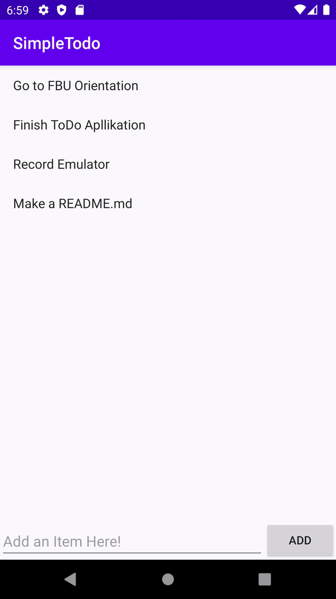

# Project 1 - SimpleToDo

**SimpleToDo** is an android app that allows building a todo list and basic todo items management functionality including adding new items, editing and deleting an existing item.

Submitted by: **Omar Guajardo**

Time spent: **6** hours spent in total

## User Stories

The following **required** functionality is completed:

* [x] User can **view a list of todo items**
* [x] User can **successfully add and remove items** from the todo list
* [x] User's **list of items persisted** upon modification and and retrieved properly on app restart

The following **stretch** features are implemented:

* [x] User can **tap a todo item in the list and bring up an edit screen for the todo item** and then have any changes to the text reflected in the todo list

The following **additional** features are implemented:

* [x] List anything else that you can get done to improve the app functionality!

## Video Walkthrough

Here's a walkthrough of implemented user stories:

GIF created with [EZGIF.com](https://ezgif.com/video-to-gif/ezgif-6-48381e8cdd69.mp4).

## Notes

* The biggest challenge was understanding why we needed to pass a method down to different Activites; however, the way activities hold data and are independent of each other is very similar to the dynamic of [Components and Props](https://reactjs.org/docs/components-and-props.html) and how they handle their independet [State](https://reactjs.org/docs/lifting-state-up.html)  in React.js, in which the action of passing data up and down the "tree" is very common and is a key part of how Components are rendered. I found this to be very similar with Android.
* 
*  For example, in order to remove an item from the List of ToDos we needed to declare a method in the `MainActivity` (were the List of ToDos lived) and **pass that down** to the `ItemsAdapter` where the individual `tvItems` could call it and envoke the method, using their position as the parameter which is data only known to the `tvItem` and to the `ItemsAdapter`, back up to the `MainActivit`y where the method could mutate the List of ToDos and then re-render the `RecyclerView`. 

## License

    Copyright 2020 The Apache Software Foundation

    Licensed under the Apache License, Version 2.0 (the "License");
    you may not use this file except in compliance with the License.
    You may obtain a copy of the License at

        http://www.apache.org/licenses/LICENSE-2.0

    Unless required by applicable law or agreed to in writing, software
    distributed under the License is distributed on an "AS IS" BASIS,
    WITHOUT WARRANTIES OR CONDITIONS OF ANY KIND, either express or implied.
    See the License for the specific language governing permissions and
    limitations under the License.
